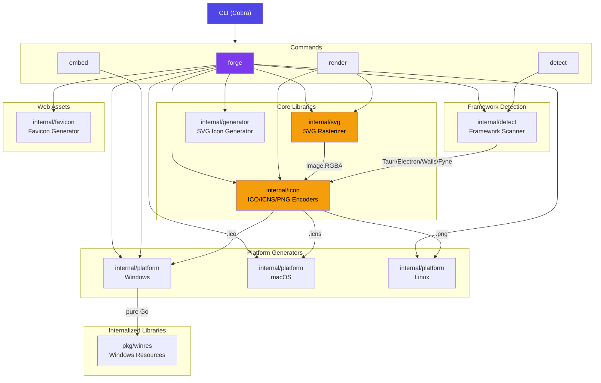
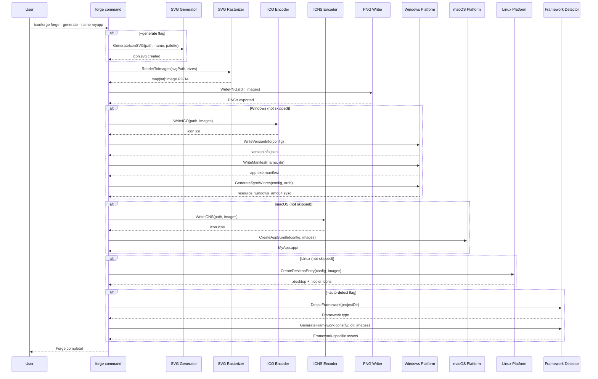
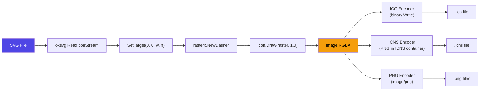
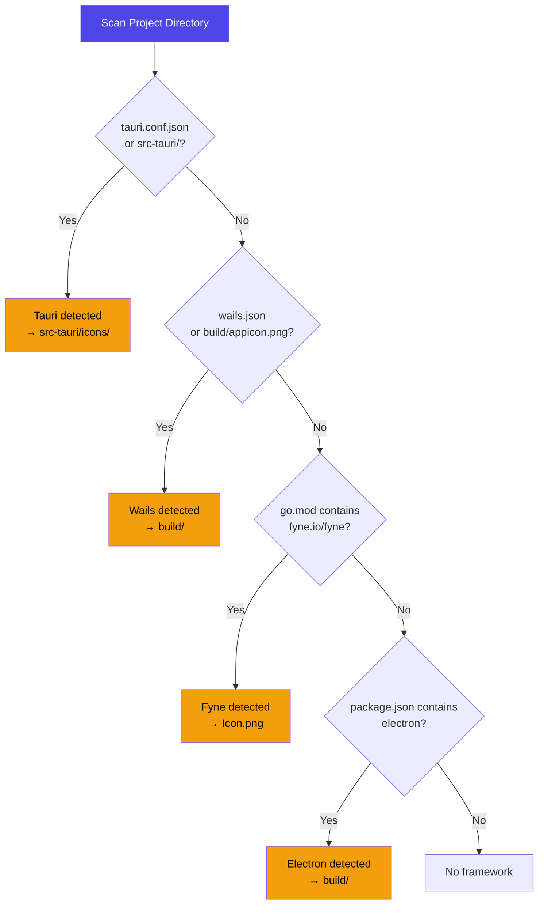

# IconForge Architecture

## System Overview

```mermaid
flowchart TB
    CLI["CLI (Cobra)"]

    subgraph Commands
        forge["forge"]
        render["render"]
        embed["embed"]
        detect_cmd["detect"]
    end

    subgraph Core ["Core Libraries"]
        svg["internal/svg<br/>SVG Rasterizer"]
        icon["internal/icon<br/>ICO/ICNS/PNG Encoders"]
        gen["internal/generator<br/>SVG Icon Generator"]
    end

    subgraph Platform ["Platform Generators"]
        win["internal/platform<br/>Windows"]
        mac["internal/platform<br/>macOS"]
        linux["internal/platform<br/>Linux"]
    end

    subgraph Detection ["Framework Detection"]
        fw["internal/detect<br/>Framework Scanner"]
    end

    subgraph Internalized ["Internalized Libraries"]
        winres["pkg/winres<br/>Windows Resources"]
    end

    subgraph Web ["Web Assets"]
        fav["internal/favicon<br/>Favicon Generator"]
    end

    CLI --> Commands
    forge --> gen
    forge --> svg
    forge --> icon
    forge --> win & mac & linux
    forge --> fw
    forge --> fav
    render --> svg
    render --> icon
    embed --> win
    detect_cmd --> fw

    svg -->|"image.RGBA"| icon
    icon -->|".ico"| win
    icon -->|".icns"| mac
    icon -->|".png"| linux

    win -->|"pure Go"| winres

    fw -->|"Tauri/Electron/Wails/Fyne"| icon

    style CLI fill:#4F46E5,color:#fff
    style forge fill:#7C3AED,color:#fff
    style svg fill:#F59E0B,color:#000
    style icon fill:#F59E0B,color:#000
```

## Forge Pipeline (Main Flow)

```mermaid
sequenceDiagram
    participant User
    participant CLI as forge command
    participant Gen as SVG Generator
    participant SVG as SVG Rasterizer
    participant ICO as ICO Encoder
    participant ICNS as ICNS Encoder
    participant PNG as PNG Writer
    participant Win as Windows Platform
    participant Mac as macOS Platform
    participant Lin as Linux Platform
    participant Det as Framework Detector

    User->>CLI: iconforge forge --generate --name myapp

    alt --generate flag
        CLI->>Gen: GenerateIconSVG(path, name, palette)
        Gen-->>CLI: icon.svg created
    end

    CLI->>SVG: RenderToImages(svgPath, sizes)
    SVG-->>CLI: map[int]*image.RGBA

    CLI->>PNG: WritePNGs(dir, images)
    PNG-->>CLI: PNGs exported

    alt Windows (not skipped)
        CLI->>ICO: WriteICO(path, images)
        ICO-->>CLI: icon.ico
        CLI->>Win: WriteVersionInfo(config)
        Win-->>CLI: versioninfo.json
        CLI->>Win: WriteManifest(name, dir)
        Win-->>CLI: app.exe.manifest
        CLI->>Win: GenerateSysoWinres(config, arch)
        Win-->>CLI: resource_windows_amd64.syso
    end

    alt macOS (not skipped)
        CLI->>ICNS: WriteICNS(path, images)
        ICNS-->>CLI: icon.icns
        CLI->>Mac: CreateAppBundle(config, images)
        Mac-->>CLI: MyApp.app/
    end

    alt Linux (not skipped)
        CLI->>Lin: CreateDesktopEntry(config, images)
        Lin-->>CLI: .desktop + hicolor icons
    end

    alt --auto-detect flag
        CLI->>Det: DetectFramework(projectDir)
        Det-->>CLI: Framework type
        CLI->>Det: GenerateFrameworkIcons(fw, dir, images)
        Det-->>CLI: Framework-specific assets
    end

    CLI-->>User: Forge complete!
```

## SVG Rasterization Pipeline

```mermaid
flowchart LR
    SVG["SVG File"] --> Parse["oksvg.ReadIconStream"]
    Parse --> Target["SetTarget(0, 0, w, h)"]
    Target --> Raster["rasterx.NewDasher"]
    Raster --> Draw["icon.Draw(raster, 1.0)"]
    Draw --> RGBA["image.RGBA"]

    RGBA --> ICO_E["ICO Encoder<br/>(binary.Write)"]
    RGBA --> ICNS_E["ICNS Encoder<br/>(PNG in ICNS container)"]
    RGBA --> PNG_E["PNG Encoder<br/>(image/png)"]

    ICO_E --> ICO_F[".ico file"]
    ICNS_E --> ICNS_F[".icns file"]
    PNG_E --> PNG_F[".png files"]

    style SVG fill:#4F46E5,color:#fff
    style RGBA fill:#F59E0B,color:#000
```

## Framework Detection Logic

```mermaid
flowchart TD
    Start["Scan Project Directory"] --> Tauri{"tauri.conf.json<br/>or src-tauri/?"}
    Tauri -->|Yes| T_Out["Tauri detected<br/>→ src-tauri/icons/"]
    Tauri -->|No| Wails{"wails.json<br/>or build/appicon.png?"}
    Wails -->|Yes| W_Out["Wails detected<br/>→ build/"]
    Wails -->|No| Fyne{"go.mod contains<br/>fyne.io/fyne?"}
    Fyne -->|Yes| F_Out["Fyne detected<br/>→ Icon.png"]
    Fyne -->|No| Electron{"package.json contains<br/>electron?"}
    Electron -->|Yes| E_Out["Electron detected<br/>→ build/"]
    Electron -->|No| None["No framework"]

    style Start fill:#4F46E5,color:#fff
    style T_Out fill:#F59E0B,color:#000
    style W_Out fill:#F59E0B,color:#000
    style F_Out fill:#F59E0B,color:#000
    style E_Out fill:#F59E0B,color:#000
```
